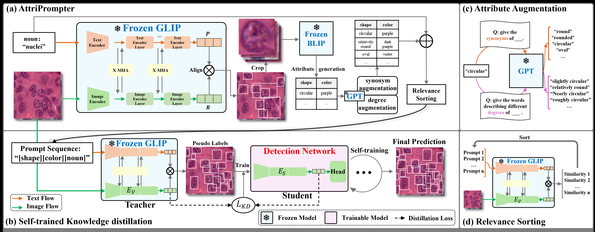

# AttriPrompter: Auto-Prompting with Attribute Semantics for Zero-shot Nuclei Detection via Visual-Language Pre-trained Models.




Official implementation of "AttriPrompter: Auto-Prompting with Attribute Semantics for Zero-shot Nuclei Detection via Visual-Language Pre-trained Models".
The original paper link is here:
[arXiv link](to be update), [TMI link](to be update).
The proposed method has two process steps:
1. Generating raw GLIP prediction results.
2. Self-training via Teacher-Student knowledge distillation framework.
## Installation
1. Create a Python environment based on the ```requirements.txt``` file.
2. Build up GLIP.
Our project is developed based on [GLIP](https://github.com/microsoft/GLIP).

```bash 
cd maskrcnn_benchmark
python setup.py develop
```
This step will install a ```maskrcnn_benchmark``` library, which is required by GLIP.

3. We recommend installing ```transformers``` library from our source code, which enables us to change some function inside the transformer backbone.
You'd better firstly uninstall ```transformers``` if you have installed it.
Then:
```bash 
cd github_src/transformers
python setup.py develop
```
## Dataset Introduction

For the convenience of downloading and using, we directly placed the dataset inside the project. It is located in DATASET/. For a dataset of tens of MB, it is far more convenient to use ```git clone``` directly than to download it from a network disk.
'coco1' was originally a MoNuSAC dataset and has been customized into COCO dataset format by us. This path will be directly called in the code, so it is not recommended to modify its path.Similarly, 'coco2' come from consep dataset and 'coco3' come from CCRCC dataset.
Making it easy for others to reproduce initial results is the original intention of our team, sincerely.

## STEP 1:Generate the raw GLIP prediction result
Before testing, please download pre-trained weights of [GLIP large model](https://huggingface.co/GLIPModel/GLIP/blob/main/glip_large_model.pth).
Then:
```bash 
python tools/test_grounding_net_wuap.py --config-file configs/pretrain/glip_Swin_L.yaml --weight glip_large_model.pth 
--prompt 'rectangular black nuclei. circle black nuclei. spherical black nuclei. rectangular dark purple nuclei. circle dark purple nuclei. spherical dark purple nuclei.' DATASETS.TRAIN ('coco1_grounding_train',) DATASETS.TEST ('coco1_val',) TEST.IMS_PER_BATCH 1 MODEL.DYHEAD.SCORE_AGG "MEAN" TEST.EVAL_TASK detection MODEL.DYHEAD.FUSE_CONFIG.MLM_LOSS False OUTPUT_DIR OUTPUT
```
Caution: ```--prompt``` param here gives an example prompt obtained from [blip](to be update), you can also input other prompts.
A JSON file recording all bbox will be generated in ```./jsonfiles```.Normally, the mAP score of raw glip should be in the range [0.15, 0.2]. Then you can use the predicted result (i.e. the json file) to run a self-training algorithm, and you will get a near SOTA score (range [0.4, 0.45]).  
Change default dataset parameter ```DATASETS.TRAIN ('coco1_grounding_train',) DATASETS.TEST ('coco1_val',) ``` as you need. The datasets information have been defined in maskrcnn_benchmark/config/paths_catalog.py. Modify it if you download new datasets.
## STEP 2:Self-Training GLIP via generated raw GLIP prediction
You can feed raw GLIP predict back to GLIP itself, train a new GLIP model with unchanged pre-trained weights(i.e. the glip_large_model.pth), and will get a better score, probably mAP in the range [0.35, 0.45]. You can repeat this process again and again. 
We placed our example raw GLIP prediction file to the path:```DATASET/coco1/annotations/instances_train2017_0166.json```, this result get mAP = 0.166.
Example instructions are following:
```bash 
python tools/train_net.py --config-file configs/pretrain/glip_Swin_L.yaml --train_label "DATASET/coco1/annotations/instances_train2017_0166.json" --restart True --use-tensorboard 
--override_output_dir OUTPUT_TRAIN_fanew DATASETS.TRAIN ('coco1_grounding_train',) DATASETS.TEST ('coco1_val',) MODEL.BACKBONE.FREEZE_CONV_BODY_AT 1 SOLVER.IMS_PER_BATCH 1 SOLVER.USE_AMP True SOLVER.MAX_EPOCH 4 TEST.DURING_TRAINING True TEST.IMS_PER_BATCH 1 SOLVER.FIND_UNUSED_PARAMETERS False SOLVER.BASE_LR 0.00001 SOLVER.LANG_LR 0.00001 DATASETS.DISABLE_SHUFFLE True MODEL.DYHEAD.SCORE_AGG "MEAN" TEST.EVAL_TASK detection AUGMENT.MULT_MIN_SIZE_TRAIN (800,) SOLVER.CHECKPOINT_PERIOD 100
```
Other example instructions : (you must install the ```Transformers``` library from github_src as mentioned in Installation because we change some layers and functions in the transformer for better mAP score )
```bash 
python tools/train_net.py --config-file configs/pretrain/glip_Swin_L.yaml --train_label "DATASET/coco1/annotations/instances_train2017_0166.json" --restart True --use-tensorboard --override_output_dir OUTPUT_TRAIN_fanew MODEL.BACKBONE.FREEZE_CONV_BODY_AT 1 SOLVER.IMS_PER_BATCH 1 SOLVER.USE_AMP True SOLVER.MAX_ITER 500 TEST.DURING_TRAINING True TEST.IMS_PER_BATCH 1 SOLVER.FIND_UNUSED_PARAMETERS False SOLVER.BASE_LR 0.00001 SOLVER.LANG_LR 0.00001 DATASETS.DISABLE_SHUFFLE True MODEL.DYHEAD.SCORE_AGG "MEAN" TEST.EVAL_TASK detection AUGMENT.MULT_MIN_SIZE_TRAIN (800,) SOLVER.CHECKPOINT_PERIOD 100 SWINBLO 3 lang_adap_mlp 2
```
More help about instuctions:
All parameters are defined in file maskrcnn_benchmark/config/defaults.py. You can find some explaination or clue about how to use the parameters there. If we did not give detail explaination about some parameter, please global search the parameter name in ./maskrcnn_benchmark for analysis.For example, global search 'froze_fuse', read the context code, and you will find this parameter froze the fuse module in GLIP.
Some important parameter: vpt_only=-4 will add the adapter of our SDPT method (our another work); SWINBLO=3 lang_adap_mlp=2 means adding an standard and efficient adapter module.


## Citation

If you use Attriprompter in your work or wish to refer to the results published in this repo, please cite our paper:
```BibTeX
@inproceedings{wu2023zero,
  title={Zero-Shot Nuclei Detection via Visual-Language Pre-trained Models},
  author={Wu, Yongjian and Zhou, Yang and Saiyin, Jiya and Wei, Bingzheng and Lai, Maode and Shou, Jianzhong and Fan, Yubo and Xu, Yan},
  booktitle={International Conference on Medical Image Computing and Computer-Assisted Intervention},
  pages={693--703},
  year={2023},
  organization={Springer}
}
```
